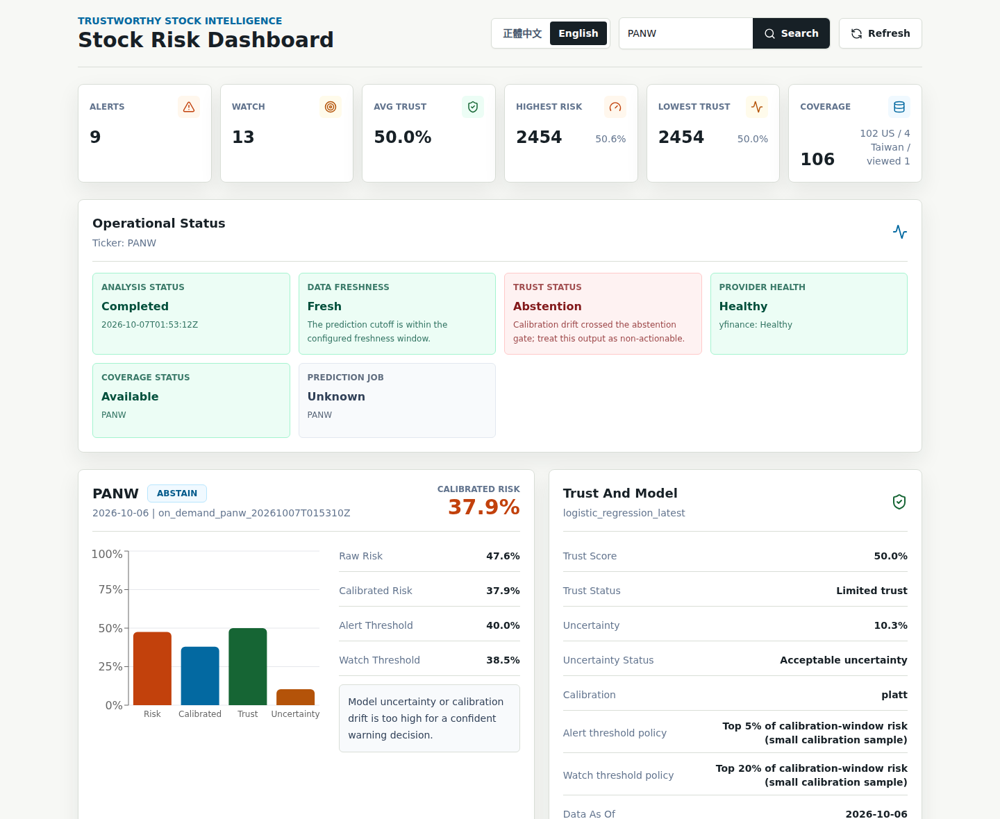
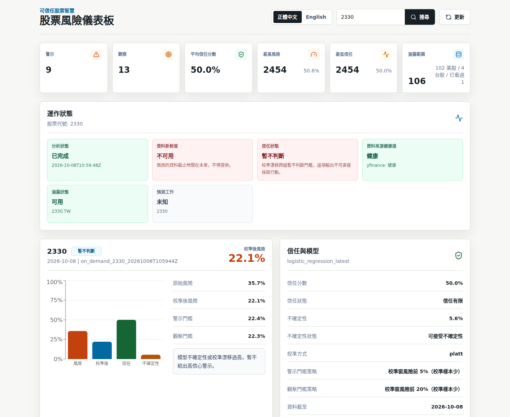

# Trustworthy Stock Intelligence

[](https://github.com/KageRyo/trustworthy-stock-intelligence/actions/workflows/ci.yml) [](https://github.com/KageRyo/trustworthy-stock-intelligence/actions/workflows/codeql.yml) [](https://github.com/KageRyo/trustworthy-stock-intelligence/actions/workflows/secret-scan.yml) [](https://sonarcloud.io/summary/new_code?id=KageRyo_trustworthy-stock-intelligence) [](https://pypi.org/project/trustworthy-stock-intelligence/) [](https://pypi.org/project/trustworthy-stock-intelligence/) [](LICENSE)

Trustworthy Stock Intelligence analyzes short-horizon drawdown risk for US and Taiwan stocks. Enter a ticker, and the system returns:

- a calibrated risk probability;
- a warning level from an explicit threshold policy;
- trust and uncertainty scores;
- reason codes and feature attributions;
- data freshness;
- the model's limitations.

Every result comes from a PostgreSQL-backed, schema-first pipeline that you can audit and reproduce.

> **Not investment advice.** This is an operational prototype and a public portfolio project for trustworthy ML. It does not trade, recommend positions, or predict prices, and its pilot evidence is not externally validated.



<details>
<summary>正體中文介面</summary>



</details>

## What makes it trustworthy

- **Calibrated, not just ranked.** Platt calibration on a held-out window turns scores into probabilities, and it is never allowed to reverse the model's ranking ([ADR 0007](docs/decisions/0007-calibration-keeps-model-ranking.md)). Thresholds come from calibration-window alert rates, not a fixed 0.5 ([ADR 0003](docs/decisions/0003-alert-rate-threshold-policy.md)).
- **Trust that is not the risk score in disguise.** Trust reflects data quality and calibration drift. Uncertainty can move a quiet row to `abstain` but never hides an alert ([ADR 0002](docs/decisions/0002-trust-independent-of-risk.md)).
- **Fails closed.**
  - The API refuses to start without PostgreSQL.
  - Stale or still-open daily bars are downgraded or blocked.
  - Small calibration samples are flagged.
- **Evidence before features.** Every model change is tested on identical purged walk-forward folds, with a held-out sample. Negative results are recorded too ([experiments](experiments/README.md)).
- **Explained in two languages.** Stable API codes are localized in English and 正體中文 ([ADR 0006](docs/decisions/0006-dashboard-localizes-api-codes.md)).

## The served model at a glance

| Item       | Today                                                                                                     |
| ---------- | --------------------------------------------------------------------------------------------------------- |
| Label      | Price falls 5% or more below today's close within 5 trading days                                          |
| Features   | 12 daily features from the ticker's own OHLCV: returns, moving-average gaps, volume, and range volatility |
| Model      | Logistic regression with Platt calibration                                                                |
| Thresholds | Alert on the top 5% of calibration-window risk; watch the top 20%                                         |
| Evidence   | AUC 0.64 on S&P 100, 0.63 on a 402-ticker S&P 500 holdout, 0.74 on 53 Taiwan large caps                   |
| Precision  | About 0.28 at a 10% base rate on S&P 100. Most alerts are still false alarms.                             |

Details, limitations, and reproduction steps are in the [model card](docs/model_card.md).

## Quick start

Requirements: Docker, [uv](https://docs.astral.sh/uv/), Go 1.27, and Node.js 22. [`mise`](https://mise.jdx.dev/) can install the pinned Go and Node versions.

```bash
cp .env.example .env            # fill in local PostgreSQL values; never commit .env
docker compose up -d postgres

uv sync --locked --extra dev --extra data --extra db --extra dashboard --extra deep
(cd frontend/stock-dashboard && npm ci)

make api                        # Go API on :18080 (Swagger UI at /swagger/)
make stock-dashboard            # dashboard on http://localhost:5175
```

- **GPU:** use `--extra deep-cu126` instead of `--extra deep` on a CUDA 12.6 workstation.
- **Missing tickers:** searching for a ticker that is not in the database runs the on-demand Python analysis, writes the result to PostgreSQL, and returns it.
- **Full walkthrough:** see the [local demo guide](docs/guides/local_demo.md).

## Tickers

Ticker symbols are strings. Taiwan codes keep leading zeros and suffix letters.

| Input      | Market behavior                                             |
| ---------- | ----------------------------------------------------------- |
| `NVDA`     | US stock through yfinance                                   |
| `2330`     | Taiwan local code, TWSE first                               |
| `6488.TWO` | TPEx listed symbol                                          |
| `00981A`   | Taiwan alphanumeric ETF code, not a US ticker               |
| `5240`     | Falls back to TPEx emerging data when listed providers miss |

```bash
curl http://localhost:18080/api/v1/analysis/2330
```

The response schema is documented in the [analysis API reference](docs/reference/api/analysis_api.md) and in [`openapi.yaml`](docs/reference/api/openapi.yaml). A ticker without enough labeled history returns a typed `abstain` analysis with an `insufficient_history` reason, not an error.

## Architecture

```text
yfinance / TWSE / TPEx
-> Python ingestion and ML core
-> PostgreSQL: market_bars, prediction_batches, warning_records, watchlists
-> Go API gateway (DB-required, typed errors, OpenAPI)
-> TypeScript dashboard (Zod-validated, English and 正體中文)
```

See [architecture](docs/concepts/architecture.md) and the [PostgreSQL serving decision](docs/decisions/0001-postgresql-serving-source.md).

## Python package

The ML core is published on PyPI. Provider ingestion is an optional extra:

```bash
python -m pip install "trustworthy-stock-intelligence[data]"
tsi --version
tsi inspect-csv path/to/ohlcv.csv --json
```

The Go API, dashboard, and PostgreSQL schema are not part of the wheel; see the [Python package guide](docs/guides/python_package.md).

## Documentation

| I want to...                               | Go to                                                                                        |
| ------------------------------------------ | -------------------------------------------------------------------------------------------- |
| Find any document                          | [Documentation index](docs/README.md)                                                        |
| Understand the served model and its limits | [Model card](docs/model_card.md)                                                             |
| See why the system is built this way       | [Decision records](docs/decisions/README.md)                                                 |
| Read the evidence                          | [Experiment index](experiments/README.md)                                                    |
| Use the dashboard                          | [User guide](docs/guides/user_guide.md)                                                      |
| Develop, test, and release                 | [Development guide](docs/guides/development.md), [release checklist](docs/guides/release.md) |
| Check data and model licensing             | [Data and model licenses](docs/concepts/data_and_model_licenses.md)                          |
| See what is planned                        | [Roadmap](docs/roadmap.md)                                                                   |
| Contribute or cite                         | [CONTRIBUTING.md](CONTRIBUTING.md), [CITATION.cff](CITATION.cff)                             |
| Read release notes                         | [CHANGELOG.md](CHANGELOG.md)                                                                 |

## Development checks

```bash
make docs-check                                   # mdformat and Markdown link checks
uv run --locked --no-sync python -m pytest
uv run --locked --no-sync python -m ruff check src tests scripts dashboard
(cd services/api-gateway-go && CGO_ENABLED=0 go test ./...)
(cd frontend/stock-dashboard && npm test && npm run build)
```

- **CI:** runs these checks, plus Go vulnerability and race tests, `npm audit`, a PostgreSQL watchlist-to-warning E2E pipeline, CodeQL, and full-history Gitleaks.
- **Repository settings:** see [`.github/REPOSITORY_SETTINGS.md`](.github/REPOSITORY_SETTINGS.md).
- **Tool versions:** see the [environment guide](docs/guides/environment.md).

## License

Source code and documentation are licensed under the [Apache License 2.0](LICENSE). The license does not grant rights to Yahoo Finance, TWSE, or TPEx data. Raw data and model artifacts are not distributed; see [data and model licenses](docs/concepts/data_and_model_licenses.md).
