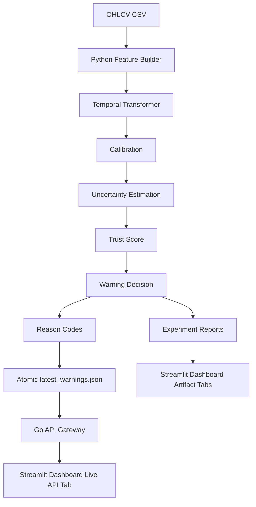

# System Architecture

Trustworthy Stock Intelligence v1 is a local production-like demo with a clear
Python/Go split.



## Python ML Core

Python owns data science and model behavior:

- OHLCV feature generation
- leakage-aware sequence dataset construction
- Temporal Transformer training
- model bundle save/load
- calibrated probability inference
- uncertainty estimation
- trust score and warning decision
- reason codes
- atomic serving JSON output

Key entry points:

```text
scripts/train_deep.py
scripts/predict_deep.py
```

## Serving Contract

`scripts.predict_deep` writes:

```text
data/artifacts/latest_predictions.csv
data/artifacts/latest_warnings.json
```

`latest_warnings.json` is a `PredictionBatch` containing `PredictionRecord`
items with:

```text
ticker
date
risk_probability
calibrated_risk_probability
uncertainty_score
trust_score
warning_level
reason_codes
```

The JSON file is written through a temporary file and `os.replace`, so serving
processes do not observe partial writes.

## Go API Gateway

Go owns user-facing read-only API serving:

- load `latest_warnings.json`
- reload when file modification time changes
- keep the last valid batch if reload fails
- serve latest warnings, ticker lookup, model metadata, health, and status
- support simple `level` and `limit` query filters

Go does not:

- run feature engineering
- load PyTorch models
- run inference
- call Python synchronously per request
- connect to Redis/PostgreSQL in v1

## Dashboard

Streamlit has two views:

- artifact tabs for experiment summaries, diagnostics, threshold sweeps, and
  optional ticker-level prediction CSVs
- Live API tab that reads the Go gateway for current warning output

## Local Demo Flow

```bash
make predict-latest
make api
make dashboard
```

The resulting system demonstrates:

```text
Python inference -> JSON serving contract -> Go API -> Dashboard
```
