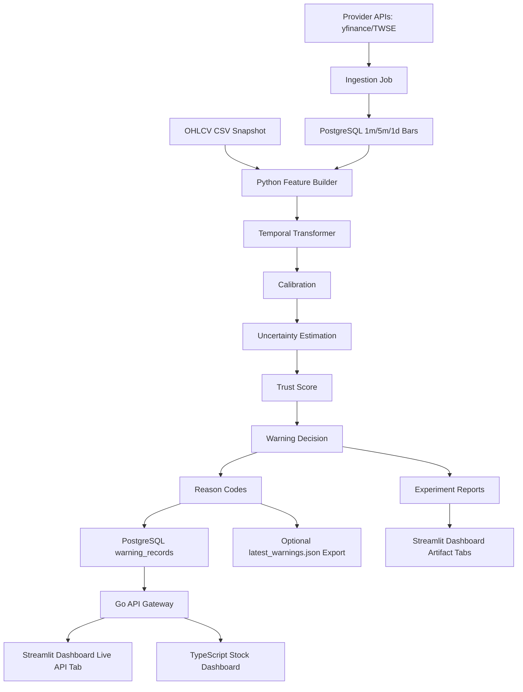

# System Architecture

Trustworthy Stock Intelligence v1 is a local production-like demo with a clear
Python/Go split.



## Data Layer

Provider APIs are ingestion sources. The project should preserve snapshots for
trustworthy ML runs instead of relying on request-time provider calls.

The chosen medium-term store is PostgreSQL:

```text
provider API -> PostgreSQL market_bars -> feature/inference job -> warnings
```

The schema supports:

```text
1m
5m
1d
```

The near-real-time freshness target is 5-minute bars. Go serving is DB-backed
and requires PostgreSQL. JSON exports are optional artifacts for debugging,
notifications, or compatibility scripts.

## Python ML Core

Python owns data science and model behavior:

- OHLCV feature generation
- leakage-aware sequence dataset construction
- Temporal Transformer training
- model bundle save/load
- calibrated probability inference
- uncertainty estimation
- trust score and warning decision
- reason codes
- atomic serving JSON output

Key entry points:

```text
scripts/train_deep.py
scripts/predict_deep.py
```

## Serving Contract

Prediction scripts write serving records into PostgreSQL:

```text
prediction_batches
warning_records
```

The optional `latest_warnings.json` export is a `PredictionBatch` containing
`PredictionRecord` items. Batch-level metadata includes:

```text
schema_version
run_id
data_as_of
generated_at
record_count
```

Record-level fields include:

```text
ticker
date
risk_probability
calibrated_risk_probability
uncertainty_score
trust_score
warning_level
reason_codes
```

When JSON export is enabled, the file is written through a temporary file and
`os.replace`, so readers do not observe partial writes.

## Go API Gateway

Go owns user-facing read-only API serving:

- connect to PostgreSQL through `TSI_DATABASE_URL`
- read latest `prediction_batches` and `warning_records`
- manage DB-backed watchlists
- serve latest warnings, ticker lookup, model metadata, health, status, and metrics
- serve typed ticker analysis responses for dashboard use
- support `level`, `limit`, `sort`, and `order` query filters

Go does not:

- run feature engineering
- load PyTorch models
- run inference
- call Python synchronously per request
- start without PostgreSQL

## Dashboards

The TypeScript stock dashboard is the primary ticker analysis UI. It reads the
Go API and validates response payloads with Zod schemas before rendering.

Primary endpoints:

```text
GET /api/v1/analysis/{ticker}
GET /api/v1/watchlists/{session-name}
POST /api/v1/watchlists/{session-name}/tickers
DELETE /api/v1/watchlists/{session-name}/tickers/{ticker}
GET /api/v1/tickers
GET /api/v1/warnings/latest
GET /api/v1/status
GET /api/v1/models/current
```

The analysis endpoint is schema-owned by Go structs in
`services/api-gateway-go/internal/http/analysis.go` and documented in
`docs/api/analysis_api.md`.

Streamlit has two views:

- artifact tabs for experiment summaries, diagnostics, threshold sweeps, and
  optional ticker-level prediction CSVs
- Live API tab that reads the Go gateway for current warning output

## Local Demo Flow

```bash
make predict-latest
make api
make dashboard
```

The resulting system demonstrates:

```text
Python inference -> JSON serving contract -> Go API -> Dashboard
```
